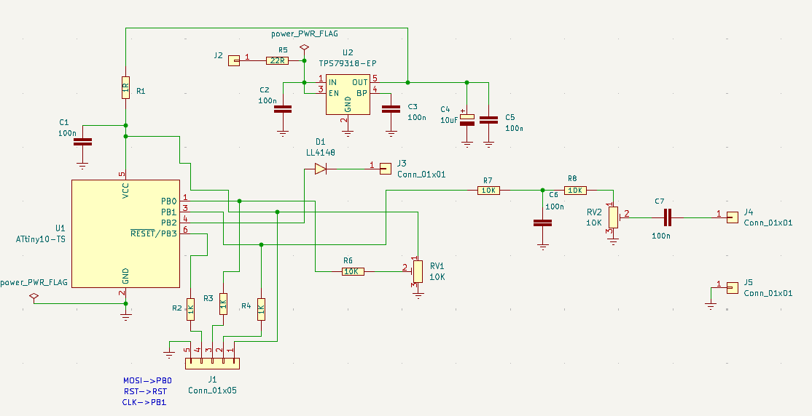
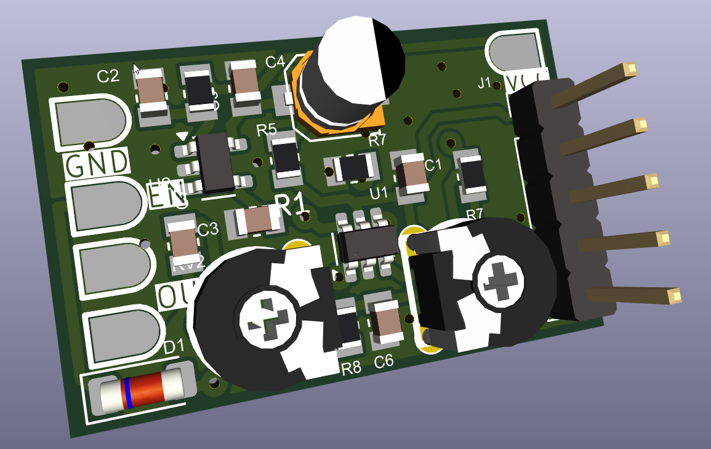

# CTCSS Generator with ATtiny10

## Introduction

This project demonstrates how to implement a **PWM-based CTCSS generator** using an **ATtiny10**.  
The code generates a sine wave by using PWM as a DAC and outputting values from a sine table.  

Since the ATtiny10 has very limited memory, only **one quadrant of the sine table** is stored, and the table is expanded to cover all four quadrants.  

Additionally, a pin on the ATtiny10 is used as an **enable signal** to cut the output when it is not needed, for example when the receiver is in RX mode or when repeater access is not required.

---

## Usage

The generator can produce **42 standard subtones**. Frequency selection is done manually using an **external potentiometer**.  

To set the desired CTCSS tone:  
1. Use a receiver with the target subtone active.  
2. Adjust the potentiometer until the squelch of the receiver opens.  

---

## PCB and Schematic

The circuit schematis is the folowing:

A small PCB has been designed to implement this circuit conveniently.

---

## Remarks

- The frequency stability is limited because the ATtiny10 uses its **internal 8 MHz clock**.  
- Despite this, it achieves approximately **±0.5 Hz** accuracy on low subtones, which is sufficient to open most repeaters.

---

## License

This project is licensed under the **GPL v2**.